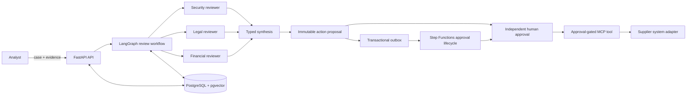
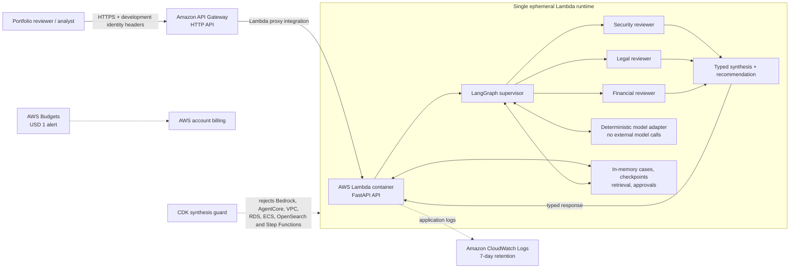

# Supplier Assurance Copilot

Governed multi-agent supplier-risk review with evidence-backed recommendations,
durable human approval, and deterministic enterprise actions.

[](pyproject.toml)
[](infra/docker-compose.yaml)
[](infra/iac)
[](LICENSE)

Supplier Assurance Copilot is a portfolio/reference implementation of a third-party risk-review
system. It coordinates security, legal, and financial reviewers, produces typed findings with
source evidence, pauses for analyst confirmation, and turns the final recommendation into an
immutable action proposal.

The central design rule is simple: **the AI recommends; deterministic services authorize and
execute**. A separate human approver controls consequential actions, and the MCP execution tool
reloads approved arguments from PostgreSQL instead of accepting model-supplied write parameters.

The repository includes:

- a deterministic, credential-free backend for local development and CI;
- native OpenAI Responses and Amazon Bedrock Converse adapters;
- an isolated LiteLLM gateway option for centrally managed model routing;
- separate AWS demo and production CDK stacks with explicit cost and durability boundaries.

> Supplier Assurance Copilot demonstrates production-oriented controls and architecture
> tradeoffs. It is not a deployed production supplier-management system, and its deterministic
> fixtures are not evidence that a live model or supplier should be trusted.

## Why Supplier Assurance Copilot

Supplier onboarding is document-heavy and crosses several specialist teams. Reviewers need to
understand security questionnaires, contracts, financial evidence, and internal policy while
preserving a clear record of what was found, who approved the outcome, and what changed in an
enterprise system.

This project makes those responsibilities inspectable:

- run security, legal, and financial analysis in parallel;
- require structured findings with evidence, severity, confidence, and remediation;
- treat document content as untrusted evidence rather than agent instructions;
- checkpoint analyst clarification and resume it after a process restart;
- separate probabilistic recommendations from deterministic approval and execution;
- preserve tenant boundaries, append-only audit events, and idempotent retries;
- deliver long-running approval work through Step Functions without keeping an AI runtime alive.

## Key Features

- **Bounded multi-agent review**: LangGraph coordinates three narrow specialists and one synthesis
  step rather than an open-ended agent conversation.
- **Durable human-in-the-loop state**: PostgreSQL checkpoints preserve analyst interrupts and
  completed specialist work across runtime restarts.
- **Governed enterprise actions**: model output becomes an immutable proposal; a different human
  approves it; MCP accepts only the action ID and reloads approved arguments server-side.
- **Failure-safe delivery**: a transactional outbox, leased retries, stable workflow names, and
  stored execution receipts make at-least-once delivery safe.
- **Evidence retrieval**: structural chunking, deterministic or Bedrock embeddings, case-local
  pgvector search, and Docling parsing boundaries support source-grounded review.
- **Identity and tenancy controls**: development headers support local demos while production
  configuration validates OIDC access tokens and tenant-scopes business state.
- **Credential-free verification**: deterministic generation, in-memory defaults, safety tests,
  and a complete Docker smoke path run without a paid model API.
- **Two honest AWS paths**: an ephemeral, guarded demo stack is isolated from the intentionally
  billable and durable production architecture.

## Architecture



LangGraph owns cognitive review state, parallel specialists, analyst clarification, and
checkpoints. Step Functions owns the outer business lifecycle and formal approval wait.
PostgreSQL remains authoritative for cases, reviews, proposals, approvals, audit events, outbox
messages, and checkpoints.

## Supported Providers

| Provider | Credential | Intended use |
| --- | --- | --- |
| Deterministic | None | Offline development, tests, CI, and repeatable demonstrations |
| OpenAI Responses | `OPENAI_API_KEY` | Native hosted model generation |
| Amazon Bedrock | AWS credentials | Converse generation and Titan embeddings |
| LiteLLM | Gateway configuration | Isolated logical-model routing through a trusted proxy |

Provider availability is configuration-driven. Live providers are opt-in, and provider fallback
must never weaken a case's data-classification policy.

## Quick Start: Credential-Free Docker Stack

Requirements: Docker Desktop or Docker Engine, Docker Compose v2, and `make`. Python, Node.js,
CDK, and the AWS CLI are not installed or run on the host for project workflows.

```bash
make env
make dev-build
```

Open:

| Service | URL |
| --- | --- |
| API documentation | <http://localhost:8000/docs> |
| API health | <http://localhost:8000/health> |

The API, PostgreSQL, Redis, and outbox worker run in containers. The API uses hot reload while the
source tree is bind-mounted. The default model remains deterministic, so this path makes no live
model or cloud calls. Stop it with `Ctrl+C`, or use `make dev-down` from another terminal.

## Complete Governed Docker Flow

Requirements: Docker Desktop or Docker Engine, Docker Compose v2, and `make`.

```bash
make env
make governance-up
make smoke
```

The governed profile starts FastAPI, PostgreSQL with pgvector, Redis, the transactional outbox
worker, and the approval-gated MCP server. The smoke verifies migrations, retrieval, durable
pause/resume, review persistence, independent approval, MCP execution, and audit history without
requiring model credentials.

| Service | URL |
| --- | --- |
| API documentation | <http://localhost:8000/docs> |
| API health | <http://localhost:8000/health> |
| MCP endpoint | <http://localhost:8001/mcp> |

Stop the stack while preserving local volumes:

```bash
make governance-down
```

Docker publishes PostgreSQL on host port 55432 by default to avoid colliding with a local
PostgreSQL installation. Override it with `POSTGRES_HOST_PORT` if needed. Use `make down-v` only
when you also want to remove local volumes.

Business endpoints require explicit local identity headers when `AUTH_MODE=dev`:

```text
X-Actor-ID: analyst@example.com
X-Tenant-ID: tenant-demo
X-Roles: analyst
```

## Review And Approve A Supplier

Create a case:

```bash
curl -X POST http://localhost:8000/api/v1/cases \
  -H 'content-type: application/json' \
  -H 'X-Actor-ID: analyst@example.com' \
  -H 'X-Tenant-ID: tenant-demo' \
  -H 'X-Roles: analyst' \
  -d '{
    "supplier_name": "Northstar Analytics",
    "description": "Critical analytics processor",
    "documents": [
      {
        "title": "Security questionnaire",
        "content": "Administrators may use shared credentials."
      },
      {
        "title": "Master services agreement",
        "content": "The customer accepts unlimited liability."
      }
    ]
  }'
```

The simple synchronous path is `POST /api/v1/cases/{case_id}/reviews`. To demonstrate a durable
human-in-the-loop execution, start a review with a client idempotency key:

```text
POST /api/v1/cases/{case_id}/review-executions
{
  "idempotency_key": "<uuid>",
  "require_evidence_confirmation": true
}
```

The response contains an opaque `execution_id` and an `awaiting_input` interrupt. The analyst can
inspect it with `GET /api/v1/cases/{case_id}/review-executions/{execution_id}` and resume the same
checkpoint with:

```text
POST /api/v1/cases/{case_id}/review-executions/{execution_id}/resume
{
  "decision": "confirm",
  "comment": "Evidence checked against the source documents."
}
```

Repeating the start request with the same idempotency key or redelivering a terminal resume does
not rerun completed graph nodes or create another persisted review.

After review, POST `/api/v1/cases/{case_id}/actions` with an idempotency UUID. A different
principal carrying the `approver` role must POST a decision to
`/api/v1/actions/{action_id}/decision`. Only then can the MCP
`execute_supplier_decision(action_id)` tool apply the immutable stored arguments.

## Configure Live Providers

Copy `.env.example` to `.env` with `make env`, then set `MODEL_BACKEND` to `openai`, `bedrock`,
or `litellm`. The default remains `deterministic`.

- OpenAI requires `OPENAI_API_KEY` and uses the native Responses API adapter.
- Bedrock requires AWS credentials and `BEDROCK_MODEL_ID` and uses Converse.
- LiteLLM requires a reachable proxy and a configured logical model alias.

LiteLLM runs under the opt-in `gateway` Compose profile and is intentionally not installed into
the application environment: the proxy currently carries its own MCP dependency line, while this
project targets the current MCP v2 SDK. Set a non-empty LITELLM_MASTER_KEY and
LITELLM_BEDROCK_MODEL before starting it with `make gateway-up`.

Live-provider promotion requires the evaluation suite to pass for the exact model and prompt
version. Provider fallback is never allowed to weaken a case's data-classification policy.

## Environment Variables

| Variable | Required | Purpose |
| --- | --- | --- |
| `MODEL_BACKEND` | Yes | `deterministic`, `openai`, `bedrock`, or `litellm` |
| `OPENAI_API_KEY` | For OpenAI | Server-side OpenAI credential |
| `BEDROCK_MODEL_ID` | For Bedrock | Bedrock Converse model identifier |
| `LITELLM_BASE_URL` | For LiteLLM | Trusted gateway endpoint |
| `DATABASE_URL` | For PostgreSQL | SQLAlchemy async database URL |
| `CHECKPOINT_BACKEND` | No | `memory` or `postgres` LangGraph checkpoints |
| `AUTH_MODE` | Yes | Development headers or OIDC token validation |
| `OIDC_ISSUER`, `OIDC_AUDIENCE` | For OIDC | Production identity validation |
| `APPROVAL_WORKFLOW_BACKEND` | Yes | Local approval or Step Functions |
| `EMBEDDING_BACKEND` | Yes | Deterministic or Bedrock embeddings |

Never commit `.env`, API keys, AWS credentials, private endpoints, supplier documents, or
generated review outputs containing sensitive information.

## Development And Quality Checks

Run the credential-free quality suite through Docker:

```bash
make test
make test-unit
make test-integration
make test-eval
make lint
make typecheck
make iac-test
```

Use `make test-checkpoint` for the focused two-runtime PostgreSQL recovery test and `make test-mcp`
for the transport-free MCP protocol test. `make iac-test` executes CDK assertions and TypeScript
checks in the Node tooling container. Migrations, formatting, smoke checks, and CDK commands also
run in containers.

Run `make help` for the complete command list.

## Repository Structure

```text
multi-agent-system/
├── apps/
│   ├── api/                    # FastAPI routes, dependencies, migrations
│   ├── agent_runtime/          # AgentCore-compatible LangGraph entry point
│   ├── approval_status/        # private Step Functions polling Lambda
│   ├── mcp_server/             # approval-gated MCP execution service
│   ├── outbox_worker/          # transactional outbox dispatcher
│   └── worker/                 # document-ingestion worker boundary
├── configs/                    # prompts, routing, and LiteLLM configuration
├── docs/
│   ├── adr/                    # architecture decision records
│   ├── architecture/           # system boundaries and request flow
│   ├── runbooks/               # local and AWS operating instructions
│   └── threat-model/           # assets, trust boundaries, and invariants
├── infra/
│   ├── iac/                    # isolated demo and production AWS CDK stacks
│   ├── docker-compose.yaml     # base PostgreSQL, Redis, API, and profiles
│   └── docker-compose.dev.yaml # hot-reload overlay
├── packages/
│   ├── governance/             # proposal, approval, and execution lifecycle
│   ├── graphs/                 # bounded supplier-review workflow
│   ├── identity/               # development and OIDC authentication
│   ├── model_gateway/          # deterministic and live-provider adapters
│   ├── outbox/                 # leased delivery and retry policy
│   ├── persistence/            # SQLAlchemy models and repositories
│   ├── retrieval/              # parsing, chunking, embeddings, and search
│   ├── schemas/                # shared typed contracts
│   └── workflows/              # approval workflow adapters
├── scripts/                    # Docker-backed startup wrappers and smoke checks
├── tests/                      # unit, integration, evaluation, and safety tests
├── Makefile                    # Docker-backed runtime, test, and CDK commands
└── pyproject.toml              # dependencies and tool configuration
```

## Architecture Notes

- [System architecture](docs/architecture/overview.md)
- [Cognitive and business orchestration boundary](docs/adr/0001-orchestration-boundaries.md)
- [Provider access decision](docs/adr/0002-model-access.md)
- [Governed enterprise actions](docs/adr/0003-governed-actions.md)
- [Transactional outbox](docs/adr/0004-transactional-outbox.md)
- [PostgreSQL LangGraph checkpoints](docs/adr/0005-langgraph-postgres-checkpoints.md)
- [Production approval polling](docs/adr/0006-production-approval-status-polling.md)
- [Threat model](docs/threat-model/initial.md)

## AWS Deployment

The diagrams below reflect the resources and runtime boundaries currently created by the two
isolated AWS CDK stacks. Roadmap components that are not yet deployed are deliberately omitted.

### Mandatory Demo Architecture

The demo stays inside the explicit Free Plan / Free Tier allowlist. It uses synthetic data, a
deterministic model adapter, and process memory; a Lambda cold start or redeployment can erase all
state.



### Production Architecture

Production is intentionally billable and durable. Public traffic terminates at a protected load
balancer; application workloads run in private subnets, and PostgreSQL runs in isolated Multi-AZ
database subnets. Human approval is outside the cognitive agent loop.

```mermaid
flowchart TB
    Analyst["Enterprise analyst"] -->|"sign in"| IdP["Enterprise OIDC provider"]
    IdP -->|"short-lived access token"| Analyst
    Analyst -->|"HTTPS + bearer token"| DNS["Amazon Route 53"]
    AgentClient["Authorized agent client"]

    subgraph AwsAccount["Production AWS account"]
        DNS --> WAF["AWS WAF<br/>managed rule groups"]

        subgraph VPC["VPC across three Availability Zones"]
            subgraph Public["Public subnets"]
                ALB["Application Load Balancer<br/>TLS certificate"]
                NAT["Three NAT gateways"]
            end

            subgraph Application["Private application subnets"]
                API["ECS Fargate API<br/>FastAPI, 2-10 tasks"]
                Outbox["ECS Fargate outbox workers<br/>two tasks"]
                MCP["ECS Fargate MCP server<br/>two tasks + Cloud Map"]
                ApprovalLambda["Approval-status Lambda"]
                AgentRuntime["Bedrock AgentCore Runtime<br/>LangGraph multi-agent workflow"]
            end

            subgraph Database["Private isolated database subnets"]
                Postgres["Amazon RDS PostgreSQL 16<br/>Multi-AZ + pgvector"]
            end

            S3Endpoint["S3 gateway endpoint"]

            ALB -->|"OIDC-protected API requests"| API
            API -->|"cases, reviews, checkpoints,<br/>actions and transactional outbox"| Postgres
            Outbox <-->|"leased outbox records"| Postgres
            MCP <-->|"approved immutable actions"| Postgres
            ApprovalLambda -->|"read committed action status"| Postgres
            AgentRuntime <-->|"durable LangGraph checkpoints"| Postgres
            API -->|"private service discovery"| MCP
            API --> S3Endpoint
        end

        WAF --> ALB

        AgentClient -->|"invoke stable endpoint"| AgentEndpoint["AgentCore Runtime endpoint"]
        AgentEndpoint --> AgentRuntime

        API -->|"Bedrock Converse"| Bedrock["Amazon Bedrock<br/>approved foundation model"]
        AgentRuntime -->|"model invocation"| Bedrock
        S3Endpoint --> Evidence["Amazon S3 evidence bucket<br/>KMS, versioning, Object Lock"]

        Outbox -->|"idempotent start execution"| StepFunctions["AWS Step Functions Standard<br/>formal human-approval workflow"]
        StepFunctions -->|"poll every five minutes"| ApprovalLambda

        API -.-> Telemetry["CloudWatch Logs, metrics and alarms"]
        Outbox -.-> Telemetry
        MCP -.-> Telemetry
        StepFunctions -.-> Telemetry
        AgentRuntime -.-> Observability["AgentCore telemetry<br/>CloudWatch + AWS X-Ray"]

        KMS["AWS KMS customer-managed key"] -.->|"encrypts"| Postgres
        KMS -.->|"encrypts"| Evidence
        KMS -.->|"encrypts"| Telemetry
        BudgetProd["AWS Budgets<br/>monthly production alert"] -.-> Billing["Production AWS account spend"]
    end

    API -.->|"validate issuer, audience and JWKS"| IdP
    MCP -->|"narrow idempotent write<br/>only after approval"| SupplierSystem["Enterprise supplier system"]
```



Follow the strict deployment instructions in
[docs/runbooks/aws-deployment.md](docs/runbooks/aws-deployment.md):

- mandatory demo: Free Plan / Free Tier eligible services only, deterministic, and ephemeral;
- production: intentionally billable, durable, private, Multi-AZ, and AgentCore-enabled.

## Status And Limitations

- Supplier Assurance Copilot is a portfolio/reference implementation, not a deployed production
  supplier-management or third-party-risk service.
- The deterministic provider proves workflow behavior and safety rules; it does not measure live
  model quality.
- The demo CDK stack is intentionally ephemeral and excludes durable, billable production
  services. A Lambda cold start or redeployment can erase its in-memory state.
- The production CDK stack is an implemented architecture and deployment definition, not evidence
  of a live production deployment or operational readiness.
- Original-document upload to S3, queued Docling ingestion, and page-level citation coordinates
  remain roadmap work.
- The enterprise supplier adapter is an in-memory demonstration boundary rather than a real
  external-system integration.
- The production approval workflow polls committed state every five minutes; a callback bridge is
  a future latency optimization, not the current deployed path.
- Live-provider behavior depends on exact model versions, prompts, quotas, regional availability,
  data-classification controls, and release evaluation.
- Performance, disaster recovery, penetration, model-quality, and operational-readiness testing
  are still required before describing the whole platform as production-ready.

## Roadmap

1. Add S3 upload handling, a Docling worker queue, and citation coordinates.
2. Route API review execution through the stable AgentCore Runtime endpoint and expose the MCP
   service through AgentCore Gateway.
3. Add an actual supplier sandbox API and Step Functions callback-token ingestion.
4. Add OpenSearch hybrid retrieval, OpenTelemetry, Langfuse, Ragas, Promptfoo, and SentinelEval.

See docs/architecture/overview.md for system boundaries and delivery sequencing.

## Project Policies

This repository is published primarily as a portfolio and reference implementation. External
issues and pull requests are not currently accepted.

- [Contributing policy](CONTRIBUTING.md)
- [Security policy](SECURITY.md)
- [MIT License](LICENSE)

## Maintainer

Maintained by [Prakash Khunti](https://github.com/prkhunti).
